# What's been happening in the DID Literature?

$$\newcommand{\E}{\mathbb{E}}
\newcommand{\E}{\mathbb{E}}
\newcommand{\var}{\mathrm{var}}
\newcommand{\cov}{\mathrm{cov}}
\newcommand{\Var}{\mathrm{var}}
\newcommand{\Cov}{\mathrm{cov}}
\newcommand{\Corr}{\mathrm{corr}}
\newcommand{\corr}{\mathrm{corr}}
\newcommand{\L}{\mathrm{L}}
\renewcommand{\P}{\mathrm{P}}
\newcommand{\independent}{{\perp\!\!\!\perp}}
\newcommand{\indicator}[1]{ \mathbf{1}\{#1\} }$$


<style type="text/css">

border-top: 80px solid #BA0C2F;

.inverse {
  background-color: #BA0C2F;
}

.alert {
    font-weight:bold; 
    color: #BA0C2F;
}

.alert-blue {
    font-weight: bold;
    color: blue;
}

.remark-slide-content {
    font-size: 23px;
    padding: 1em 4em 1em 4em;
}

.highlight-red {
 background-color:red;
 padding:0.1em 0.2em;
}

.assumption-box {
    background-color: rgba(222,222,222,.5);
    font-size: x-large;
    padding: 10px; 
    border: 10px solid lightgray; 
    margin: 10px;
}

.assumption-title {
    font-size: x-large;
    font-weight: bold;
    display: block;
    margin: 10px;
    text-decoration: underline;
    color: #BA0C2F;
}
</style>


```{r echo=FALSE}
step_by_step_eq <- function(eqlist, before="", after="", title=" ") {
  
  # drop slide pauses in before content
  before_inner <- gsub("--", "", before)
  
  for (i in 2:length(eqlist)) {
    eqlist[i] <- paste0(eqlist[i-1],"\\\\\n",eqlist[i])
  }

  out <- ""
  for (i in 1:length(eqlist)) {
    if (i > 1) out <- paste0(out, "count:false", "\n")
    out <- paste0(out, "# ", title, "\n") # print title
    # print before content
    if (i == 1) out <- paste0(out, before, "\n") else out <- paste0(out, before_inner, "\n") 
    out <- paste0(out, "$$\n\\begin{aligned}\n",eqlist[[i]],"\n\\end{aligned}\n$$\n\n") # print equation
    if (i < length(eqlist)) out <- paste0(out, "---\n\n")
  }
  out <- paste0(out, after, "\n") # print after content
  out <- paste0(out, "---\n")
  cat(out)
}
```


Economists have long used two-way fixed effects (TWFE) regressions to implement DID identification strategies:
\begin{align*}
  Y_{it} = \theta_t + \eta_i + \beta^{twfe} D_{it} + e_{it}
\end{align*}

A number of papers have <span class="alert">diagnosed</span> issues TWFE regressions in this context

Summary of Issues:

* Issues arise due to treatment effect heterogeneity

* $\beta^{twfe}$ from the TWFE regression turns out to be equal to a weighted average of underlying treatment effect parameters (group-time average treatment effects)

* Weights on underlying parameters are (non-transparently) driven by estimation method and can have undesirable properties

---

# What's been happening in the DID Literature?

There have also been a number of papers <span class="alert">fixing</span> these issues

--

Intuition:

* In a first step, directly target group-time average treatment effects

* Choose weights on group-time average treatment effects to target parameters of interest (overall $ATT$, event study, or others)

---

# This paper

These papers have (largely) focused on the case with a binary, staggered treatment

<!--

* in my view, the issues that arise with a staggered treatment have largely been solved

* Many applications have a more complicated treatment

* Unlike TWFE, "treatment effect heterogeneity robust" estimation strategies do not directly handle more complicated treatment regimes

-->

<mark>Current paper:</mark> Generalize binary treatment case to multi-valued or continuous treatment (<span class="alert">"dose"</span>)

<!--

$$Y_{it} = \theta_t + \eta_i + \beta^{twfe} D_{it} + v_{it}$$
Setup:

* Treatment "continuous enough" that researcher would estimate above model rather than include a sequence of dummy variables

-->

--

<span class="alert">Example:</span>

* Effect of $\underbrace{\textrm{length of school closures}}_{\textrm{continuous treatment}}$ (during Covid) on $\underbrace{\textrm{students' test scores}}_{\textrm{outcome}}$ 

  * e.g., Ager, Eriksson, Karger, Nencka, Thomasson (2022), Gillitzer and Prasad (2023), among others

---

# This paper

For today, mostly emphasize a continuous treatment, but our results also apply to other settings (with trivial modifications):

* multi-valued treatments (e.g., effect of state-level minimum wage policies on employment) 

* binary treatment with differential "exposure" to the treatment (application in the paper: a binary Medicare policy where different hospitals had more exposure to the treatment)

But results do not apply to "fuzzy" DID setups

* Fuzzy DID refers to a setting where a researcher is ultimately interested in understanding the effect of a binary treatment but observes aggregate data (e.g., interested in learning about union wage-premium (at individual level) using state-level data and exploiting variation in the "amount" of unionization across different locations)

<!--

* Researchers often interpret $\beta^{twfe}$ as an <span class="alert">average causal response</span>

  * i.e., (an average over) casual effects of a marginal increase in the dose
  
-->

<!--

# This paper

<span class="alert">Similar issues</span> as in binary treatment literature related to regression (TWFE) estimation strategies when the treatment is multi-valued and/or continuous

As in the case with a staggered, binary treatment, we can fix all of these by (i) carefully making "good" comparisons and (ii) carefully choosing an appropriate weighting scheme


-->
  
---


# Outline

<br> <br> <br>

1. Identification: What's the same as in the binary treatment case? 

2. Identification: What's different from the binary treatment case?

3. Issues with TWFE regressions

4. Application on Medicare Spending and Capital/Labor Ratios

5. Extensions to multiple periods, variation in treatment timing

---

count: false
class: inverse, middle, center

# Identification: What's the same as in the binary treatment case? <br><br> Baseline setting with two periods

---

# Notation

Potential outcomes notation

* Two time periods: $t^*$ and $t^*-1$
  
  * No one treated until period $t^*$
    
  * Some units remain untreated in period $t^*$
  
* Potential outcomes: $Y_{it^*}(d)$

* Observed outcomes: $Y_{it^*}$ and $Y_{it^*-1}$

  $$Y_{it^*}=Y_{it^*}(D_i) \quad \textrm{and} \quad Y_{it^*-1}=Y_{it^*-1}(0)$$

---

# Parameters of Interest (ATT-type)

* Level Effects (Average Treatment Effect on the Treated)

  $$ATT(d|d) := \E[Y_{t^*}(d) - Y_{t^*}(0) | D=d]$$

  * Interpretation: The average effect of dose $d$ relative to not being treated *local to the group that actually experienced dose $d$*
  
  * This is the natural analogue of $ATT$ in the binary treatment case

--

* Slope Effect (Average Causal Responses)

  $$ACRT(d|d) := \frac{\partial ATT(l|d)}{\partial l} \Big|_{l=d} \ \ \ \textrm{and} \ \ \ ACRT^O := \E[ACRT(D|D)|D>0]$$
  
  * Interpretation: $ACRT(d|d)$ is the causal effect of a marginal increase in dose *local to units that actually experienced dose $d$*
  
  * $ACRT^O$ averages $ACRT(d|d)$ over the population distribution of the dose.  If you're estimating a TWFE regression, this is probably what you have in mind that you are targeting.


<!--
 
# Discrete Dose

* Level Effects (Average Treatment Effect on the Treated)

  $$ATT(d|d) := \E[Y_{t^*}(d) - Y_{t^*-1}(0) | D=d]$$

  * This is exactly the same as for continuous dose

--
* Slope Effect (Average Causal Responses)

  * Possible doses: $\{d_1, \ldots, d_J\}$

$$ACRT(d_j|d_j) := ATT(d_j|d_j) - ATT(d_{j-1}|d_j)$$
--

  * Interesting side-comment: In the case with a binary treatment, $ACRT(1|1) = ATT$
  
    $\implies$ In binary treatment case, $ATT$ is (in some sense) both a slope and level effect

-->

---

```{r echo=FALSE, results="asis"}

title <- "Identification"

before <- "<div class=\"assumption-box\"> <span class=\"assumption-title\">\"Standard\" Parallel Trends Assumption</span>

For all `d`,

<p style=\"text-align:center\">
`\\mathbb{E}[\\Delta Y_{t^{\\ast}} (0) | D=d] = \\mathbb{E}[\\Delta Y_{t^{\\ast}}(0) | D=0]`
</p>
</div>


--

Then,

--
"

eqlist <- list("ATT(d|d) &= \\E[Y_{t^*}(d) - Y_{t^*}(0) | D=d] \\hspace{150pt}",
               "&= \\E[Y_{t^*}(d) - Y_{t^*-1}(0) | D=d] - \\E[Y_{t^*}(0) - Y_{t^*-1}(0) | D=d]",
               "&= \\E[Y_{t^*}(d) - Y_{t^*-1}(0) | D=d] - \\E[\\Delta Y_{t^*}(0) | D=0]",
               "&= \\E[\\Delta Y_{t^*} | D=d] - \\E[\\Delta Y_{t^*} | D=0]")

after <- "<mark>This is exactly what you would expect</mark>"
step_by_step_eq(eqlist=eqlist,
                before=before,
                after=after,
                title=title)
```


count: false
class: inverse, middle, center

# Identification: What's different from the binary treatment case? <br><br> Baseline setting with two periods

---

# Are we done?

--

<mark>Unfortunately, no</mark>

--

Most empirical work with a continuous treatment wants to think about how causal responses vary across dose

* Plot treatment effects as a function of dose and ask: does more dose tends to increase/decrease/not affect outcomes?

--
  
* Average causal response parameters *inherently* involve comparisons across slightly different doses

--

There are <span class="alert">new issues</span> related to comparing $ATT(d|d)$ at different doses and interpreting these differences as <span class="alert">causal effects</span>

--

* At a high-level, these issues arise from a tension between empirical researchers wanting to use a quasi-experimental research design (which delivers "local" treatment effect parameters) but (often) wanting to compare these "local" parameters to each other

* Unlike the staggered, binary treatment case: No easy fixes here!

<!--$\implies$ this is a bigger problem than those pointed out in recent work on DID with a staggered, binary treatment-->
  

---

```{r echo=FALSE, results="asis"}
title <- "Interpretation Issues"

before <- "Consider comparing $ATT(d|d)$ for two different doses
--
"

# eqlist <- list("& ATT(d_1|d_1) - ATT(d_2|d_2) \\hspace{350pt}",
#               "& \\hspace{25pt}= \\E[Y_{t^*}(d_1) - Y_{t^*}(0) | D=d_1] - \\E[Y_{t^*}(d_2) - Y_{t^*}(0) | D=d_2]",
#               "& \\hspace{25pt}= \\underbrace{\\E[Y_{t^*}(d_1) - Y_{t^*}(d_2) | D=d_1]}_{\\textrm{Causal Response}} + \\underbrace{\\Big\\{ \\underbrace{\\E[Y_{t^*}(d_2) - Y_{t^*}(0) | D=d_1]}_{ATT(d_2|d_1)} - \\underbrace{\\E[Y_{t^*}(d_2) - Y_{t^*}(0) | D=d_2]}_{ATT(d_2|d_2)} \\Big\\}}_{\\textrm{Selection Bias}}")

eqlist <- list("& ATT(d_h|d_h) - ATT(d_l|d_l) \\hspace{350pt}",
               "& \\hspace{25pt} = \\E[Y_{t^*}(d_h)-Y_{t^*}(d_l) | D=d_h] + \\E[Y_{t^*}(d_l) - Y_{t^*}(0) | D=d_h] - \\E[Y_{t^*}(d_l) - Y_{t^*}(0) | D=d_l]",
               "& \\hspace{25pt} = \\underbrace{\\E[Y_{t^*}(d_h) - Y_{t^*}(d_l) | D=d_h]}_{\\textrm{Causal Response}} + \\underbrace{ATT(d_l|d_h) - ATT(d_l|d_l)}_{\\textrm{Selection Bias}}")

after <- "\n--

\"Standard\" Parallel Trends is not strong enough to rule out the selection bias terms here

* Implication: If you want to interpret differences in treatment effects across different doses, then you will need stronger assumptions than standard parallel trends

* This problem spills over into identifying $ACRT(d|d)$ 

"

step_by_step_eq(eqlist=eqlist,
                before=before,
                after=after,
                title=title)

```

# Alternative Parameters of Interest (ATE-type)

The underlying reason for the difficulty comparing $ATT$-type parameters is that they are "local".  This suggests that "global" parameters could circumvent these issues.

--


* Level Effects

  $$ATE(d) := \E[Y_{t^*}(d) - Y_{t^*}(0)]$$
--

* Slope Effects

$$
\begin{aligned}
  ACR(d) := \frac{\partial ATE(d)}{\partial d} \ \ \ \ & \textrm{or} \ \ \ ACR^O := \E[ACR(D) | D>0]
\end{aligned}
$$

---

```{r echo=FALSE, results="asis"}

title <- "Comparisons across dose"

before <- "ATE-type parameters do not suffer from the same issues as ATT-type parameters when making comparisons across dose

--

"

eqlist <- list("ATE(d_h) - ATE(d_l) &= \\E[Y_{t^*}(d_h) - Y_{t^*}(0)] - \\E[Y_{t^*}(d_l) - Y_{t^*}(0)]",
              "&= \\underbrace{\\E[Y_{t^*}(d_h) - Y_{t^*}(d_l)]}_{\\textrm{Causal Response}}")

after <- " 

--

<mark>Unfortunately, \"Standard\" Parallel Trends Assumption not strong enough to identify $ATE(d)$.</mark>

"

step_by_step_eq(eqlist=eqlist,
                before=before,
                after=after,
                title=title)
```

# Introduce Stronger Assumptions

<div class="assumption-box"><span class="assumption-title">"Strong" Parallel Trends</span>

For all `d` and `l`,

<p style="text-align: center">
`\mathbb{E}[Y_{t^{\ast}}(d) - Y_{t^{\ast}-1}(0) | D=l] = \mathbb{E}[Y_{t^{\ast}}(d) - Y_{t^{\ast}-1}(0) | D=d]`
</p>

</div>

--

Under Strong Parallel Trends, it is straightforward to show that

$$ATE(d) = \E[\Delta Y_{t^*} | D=d] - \E[\Delta Y_{t^*}|D=0]$$

RHS is exactly the same expression as for $ATT(d|d)$ under "standard" parallel trends, but here

* assumptions are different

* parameter interpretation is different

---

# Introduce Stronger Assumptions

<div class="assumption-box"><span class="assumption-title">"Strong" Parallel Trends</span>

For all `d` and `l`,

<p style="text-align: center">
`\mathbb{E}[Y_{t^{\ast}}(d) - Y_{t^{\ast}-1}(0) | D=l] = \mathbb{E}[Y_{t^{\ast}}(d) - Y_{t^{\ast}-1}(0) | D=d]`
</p>

</div>

This is notably different from "Standard" Parallel Trends

* All dose groups would have experienced the same path of outcomes had they been assigned the same dose

* It involves potential outcomes for all values of the dose (not just untreated potential outcomes)
  
---

# Introduce Stronger Assumptions

<div class="assumption-box"><span class="assumption-title">"Strong" Parallel Trends</span>

For all `d` and `l`,

<p style="text-align: center">
`\mathbb{E}[Y_{t^{\ast}}(d) - Y_{t^{\ast}-1}(0) | D=l] = \mathbb{E}[Y_{t^{\ast}}(d) - Y_{t^{\ast}-1}(0) | D=d]`
</p>

</div>


Strong parallel trends is also closely related to assuming a certain <span class="alert">form of treatment effect homogeneity</span>.  In particular, it implies that


$$ATT(d|l) = ATT(d|d)$$

Since this holds for all $d$ and $l$, it also implies that $ATE(d) = ATT(d|d)$ 

--

It also has the flavor of a structural assumption as it provides a route for us to extrapolate treatment effects across different values of the dose.


---

# Can you relax strong parallel trends?

Some ideas:

* It could be reasonable to assume that you know the sign of the selection bias.  This can lead to (possibly) informative bounds on differences/derivatives/etc. between $ATT(d|d)$ parameters

--

* Strong parallel trends may be more plausible after conditioning on some covariates.

  * For length of school closure, strong parallel trends probably more plausible conditional on being a rural county in the Southeast or conditional on being a college town in the Midwest.
  
  <!-- this probably does not fully rationalize recovering ATE(d), but could allow for some cross-dose comparisons...-->

---

# Positive Side-Comments: No untreated units

(1) It's possible to do some versions of DID with a continuous treatment without having access to a fully untreated group.

  * In this case, it is not possible to recover level effects like $ATT(d|d)$.
  
  * However, notice that $$\begin{aligned}& \E[\Delta Y_t | D=d_h] - \E[\Delta Y_t | D=d_l] \\ &\hspace{50pt}= \Big(\E[\Delta Y_t | D=d_h] - \E[\Delta Y_t(0) | D=d_h]\Big) - \Big(\E[\Delta Y_t | D=d_l]-\E[\Delta Y_t(0) | D=d_l]\Big) \\ &\hspace{50pt}= ATT(d_h|d_h) - ATT(d_l|d_l)\end{aligned}$$
  
  * In words: comparing path of outcomes for those that experienced dose $d_h$ to path of outcomes among those that experienced dose $d_l$ (and not relying on having an untreated group) delivers the difference between their $ATT$'s.
  
  * Still face issues related to selection bias / strong parallel trends though
      
---

# Positive Side-Comments: Alternative approaches

(2) Strategies like binarizing the treatment can still work (though be careful!)

  * If you classify units as being treated or untreated, you can recover the $ATT$ of being treated at all.
  
  * On the other hand, if you classify units as being "high" treated, "low" treated, or untreated &mdash; our arguments imply that selection bias terms can come up when comparing effects for "high" to "low"

---

# Negative Side-Comment: Pre-testing

That the expressions for $ATE(d)$ and $ATT(d|d)$ are exactly the same also means that we cannot use pre-treatment periods to try to distinguish between "standard" and "strong" parallel trends. 
In particular, the relevant information that we have for testing each one is the same

* In effect, the only testable implication of strong parallel trends in pre-treatment periods is standard parallel trends.


---

# Summarizing

* It is straightforward/familiar to identify ATT-type parameters with a continuous treatment

* However, comparison of ATT-type parameters across different doses are hard to interpret

  * They include selection bias terms
  
  * This issues extends to identifying ACRT parameters

* This suggests targeting ATE-type parameters

  * Comparisons across doses do not contain selection bias terms
  
  * But identifying ATE-type parameters requires stronger assumptions

---

count: false
class: inverse, center, middle

# Issues with TWFE Regressions

---

# TWFE

The most common strategy in applied work is to estimate the two-way fixed effects (TWFE) regression:

$$Y_{it} = \theta_t + \eta_i + \beta^{twfe} D_{it} + v_{it}$$
In baseline case (two periods, no one treated in first period), this is just

$$\Delta Y_i = \beta_0 + \beta^{twfe} \cdot D_i + \Delta v_i$$

$\beta^{twfe}$ often (loosely) interpreted as some kind of average causal response (i.e., slope effect) parameter

---
# Interpreting $\beta^{twfe}$

In the paper, we show that 

* Under Standard Parallel Trends:

  $$\beta^{tfwe} = \int_{\mathcal{D}_+} w_1(l) \left[ ACRT(l|l) + \frac{\partial ATT(l|h)}{\partial h} \Big|_{h=l} \right] \, dl$$

  * $w_1(l)$ are positive weights that integrate to 1
  
  * $ACRT(l|l)$ is average causal response conditional on $D=l$
  
  * $\frac{\partial ATT(l|h)}{\partial h} \Big|_{h=l}$ is a local selection bias term
  
---

# Interpreting $\beta^{twfe}$

In the paper, we show that 

* Under Strong Parallel Trends:

  $$\beta^{tfwe} = \int_{\mathcal{D}_+} w_1(l) ACR(l) \, dl$$

  * $w_1(l)$ are same weights as before
  
  * $ACR(l)$ is average causal response to dose $l$ across entire population
  
  * there is no selection bias term

---

name: issues

# What does this mean?

* Issue \#1: Selection bias terms that show up under standard parallel trends

  $\implies$ to interpret as a weighted average of any kind of causal responses, need to invoke (likely substantially) stronger assumptions
  
--
  
* Issue \#2: Weights

  * They are all positive
  
  * But this is a <span class="alert">very minimal</span> requirement for weights being "reasonable"
  
  * These weights have "strange" properties (i) affected by the size of the untreated group, (ii) that they are maximized at $d=\E[D]$.
  
  * [[[Example 1 - Mixture of Normals Dose](#weights-example-mixture)]] &nbsp; &nbsp; [[[Example 2: Exponential Dose](#weights-example-exponential)]]
  
<!--
  
* Issue \#4: Alternative Interpretations

  * The above decompositions of $\beta^{TWFE}$ are not unique.  For example, you can show that $\beta^{TWFE}$ is also equal to a weighted combination of $ATT(d|d)$
  
  * However, the weights on $ATT(d|d)$ integrate to 0 $\implies$ incorrect to think of $\beta^{TWFE}$ as "approximating" $ATT(d|d)$.
  
-->  
  
---

# What should you do?

1. Either (i) report $ATT(d|d)$ directly and interpret carefully, or (ii) be aware (and think through) that $\beta^{twfe}$, comparisons across $d$, or average causal response parameters all require imposing stronger assumptions

--

2. With regard to weights, there are likely better options for estimating causal effect parameters

  * Step 1: Nonparametrically estimate $ACR(d) = \frac{\partial \E[\Delta Y | D=d]}{\partial d}$
  
    * Side-comment: This is not actually too hard to estimate.  No curse-of-dimensionality, etc.
  
  * Step 2: Estimate $ACR^0 = \E[ACR(D)|D>0]$.
  
  * <span class="alert">These do not get around the issue of requiring a stronger assumption</span>

3. It's relatively straightforward to extend this strategy to settings with multiple periods and variation in treatment timing by extending exisiting work about a staggered, binary treatment

---

class: inverse, middle, center
count: false

# Empirical Application

---

# Empirical Application


This is a simplified version of Acemoglu and Finkelstein (2008)

1983 Medicare reform that eliminated labor subsidies for hospitals

* Medicare moved to the Prospective Payment System (PPS) which replaced "full cost reimbursement" with "partial cost reimbursement" which eliminated reimbursements for labor (while maintaining reimbursements for capital expenses)

* Rough idea: This changes relative factor prices which suggests hospitals may adjust by changing their input mix.  Could also have implications for technology adoption, etc.

* In the paper, we provide some theoretical arguments concerning properties of production functions that suggests that strong parallel trends holds.

---

# Data

Hospital reported data from the American Hospital Association, yearly from 1980-1986

--

Outcome is capital/labor ratio

* proxy using the depreciation share of total operating expenses (avg. 4.5%) 

* our setup: collapse to two periods by taking average in pre-treatment periods and average in post-treatment periods

Dose is "exposure" to the policy

* the number of Medicare patients in the period before the policy was implemented

* roughly 15% of hospitals are untreated (have essentially no Medicare patients)

  * AF provide results both using and not using these hospitals as (good) it is useful to have untreated hospitals (bad) they are fairly different (includes federal, long-term, psychiatric, children's, and rehabilitation hospitals)


---

# Bin Scatter

<center> 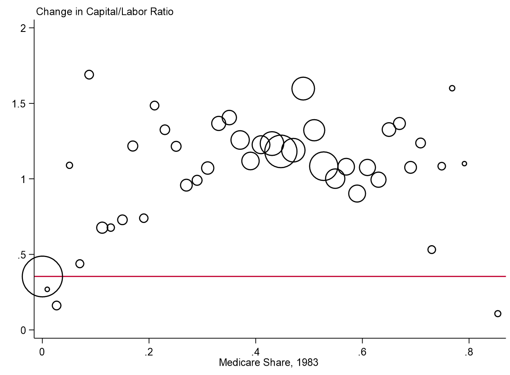 </center>

---


# ATE Plot

<center> 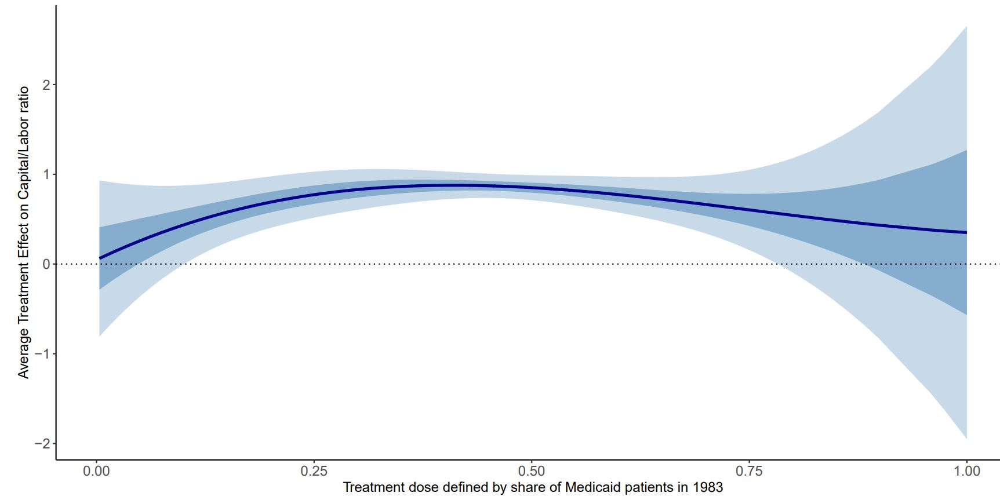 </center>

---

# ACR(T) Plot

<center> 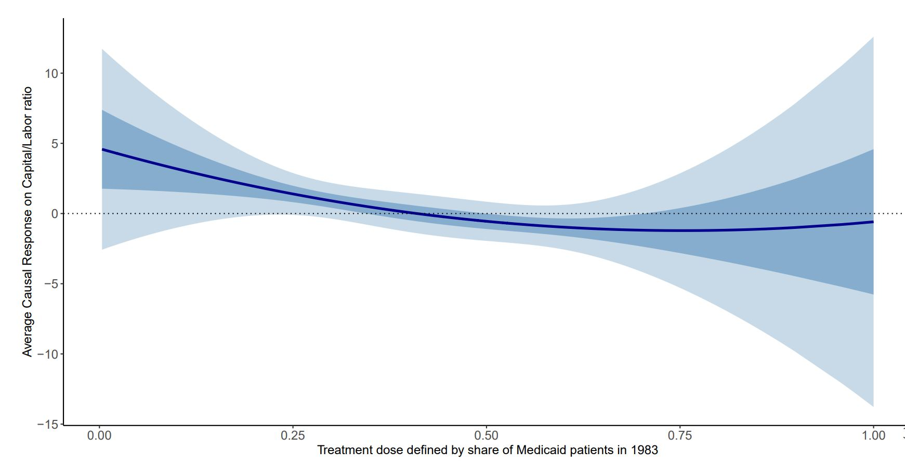 </center>

---

# Results


<center>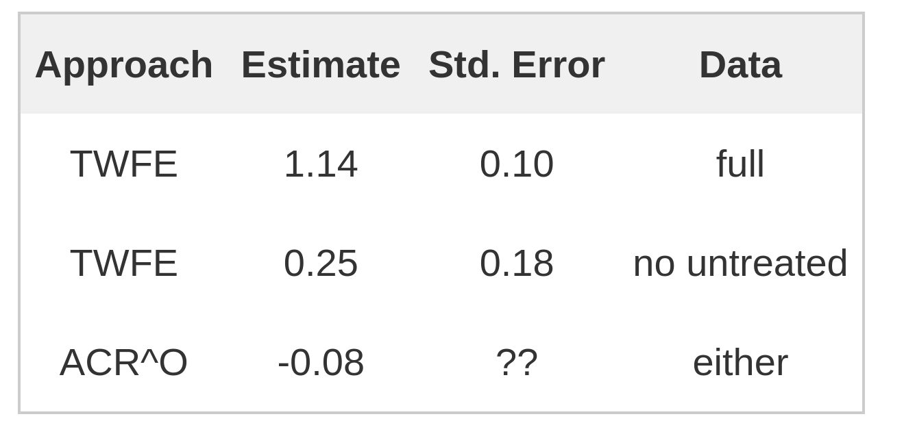</center>

<!--

$TWFE$: 1.14 (s.e.: 0.10)

* "Given that the average hospital has a 38 percent Medicare share prior to PPS, this estimate suggests that in its first three years, the introduction of PPS was associated with an increase in the depreciation share of about 0.42 (=1.13*0.38)...corresponds to a sizable 10 percent increase in the capital-labor ratio of the average Medicare share hospital."

* Probably most natural comparison for this parameter is $\widehat{ATT}(d=0.38|d=0.38) = 0.87$ (s.e.: 0.09).


Can also use the TWFE estimate to think about causal responses

* $\widehat{ACRT}^O:$ -0.078 (s.e.: ??)


Finally, if only want to exploit variation in the dose

* $TWFE$ (no untreated): 0.25 (s.e. 0.18)

* Our approach: $ATT(d|d)$ not available in this case, $ACRT^O$ does not change

-->

---


# Density weights vs. TWFE weights

<center> 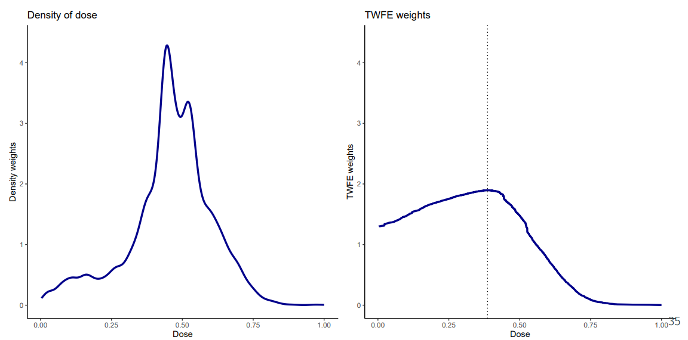 </center>

---

# TWFE Weights with and without Untreated Group

<center> 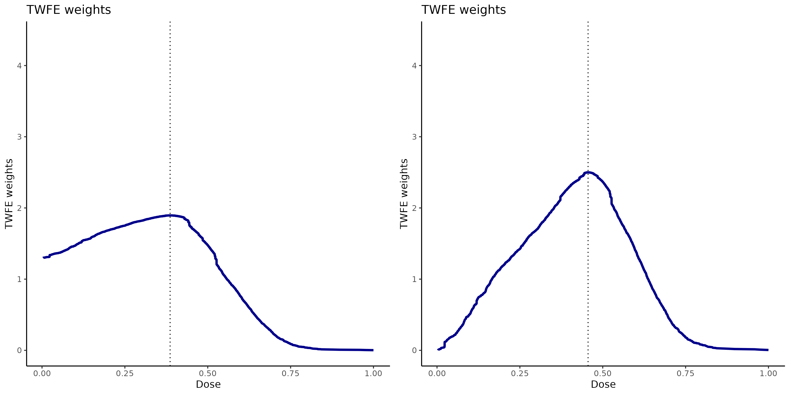 </center>

---

# Conclusion

* There are a number of challenges to implementing/interpreting DID with a continuous treatment

* The extension to multiple periods and variation in treatment timing is relatively straightforward (at least proceeds along the "expected" lines)

* But (in my view) the main new issue here is that <span class="alert">justifying interpreting comparisons across different doses as causal effects requires stronger assumptions than most researchers probably think that they are making</span>

* <mark>Link to paper:</mark> [https://arxiv.org/abs/2107.02637](https://arxiv.org/abs/2107.02637)

* <mark>Other Summaries:</mark> &nbsp; (i) [Five minute summary](https://bcallaway11.github.io/posts/five-minute-did-continuous-treatment) &nbsp; &nbsp; &nbsp;  (ii) [Pedro's Twitter](https://twitter.com/pedrohcgs/status/1415915759960690696) 

* <mark>Comments welcome:</mark> [brantly.callaway@uga.edu](mailto:brantly.callaway@uga.edu)

* <mark>Code:</mark> in progress

---

name: weights-example-mixture
count: false

# Ex. Mixture of Normals Dose

```{r echo=FALSE, message=FALSE, warning=FALSE, fig.width=15}
library(mixtools)
library(ggplot2)
draws <- rnormmix(1000,lambda=c(.5,.5),mu=c(5,12),sigma=c(1,1))
dgrid <- seq(min(draws), max(draws), length.out=100)#seq(quantile(draws,.01), quantile(draws,.99), length.out=100)
meanD <- mean(draws)
varD <- var(draws)
ED_l <- function(l) mean(draws[draws >= l])
PD_l <- function(l) mean(1*(draws>=l))
w_l <- function(l) (ED_l(l) - meanD)*PD_l(l)/varD
waits <- sapply(dgrid, w_l)
plot_df <- data.frame(weight=waits, D=dgrid)
weights_plot <- ggplot(plot_df, aes(x=D,y=weight)) +
  geom_line(color="blue", lwd=1.3) +
  labs(title="TWFE Weights") + 
  theme_minimal() + 
  ylim(c(0,.2)) + 
  xlim(c(1,16))
density_plot <- ggplot(data=data.frame(D=draws), aes(x=D)) + 
  geom_density(color="red", lwd=1.3) + 
  labs(title="Density of Dose") + 
  theme_minimal() +
  ylim(c(0,.2)) + 
  xlim(c(1,16))
ggpubr::ggarrange(density_plot,weights_plot, nrow=1)
```

[Back](#issues)

---

name: weights-example-exponential
count:false

# Ex. Exponential Dose
```{r echo=FALSE, warning=FALSE, fig.width=15}
draws <- rexp(1000, rate=1)
dgrid <- seq(min(draws), max(draws), length.out=100)#seq(quantile(draws,.01), quantile(draws,.99), length.out=100)
meanD <- mean(draws)
varD <- var(draws)
ED_l <- function(l) mean(draws[draws >= l])
PD_l <- function(l) mean(1*(draws>=l))
w_l <- function(l) (ED_l(l) - meanD)*PD_l(l)/varD
waits <- sapply(dgrid, w_l)
plot_df <- data.frame(weight=waits, D=dgrid)
weights_plot <- ggplot(plot_df, aes(x=D,y=weight)) +
  geom_line(color="blue", lwd=1.3) +
  labs(title="TWFE Weights") + 
  theme_minimal() + 
  ylim(c(0,1)) + 
  xlim(c(0,7))
density_plot <- ggplot(data=data.frame(D=draws), aes(x=D)) + 
  geom_density(color="red", lwd=1.3) + 
  labs(title="Density of Dose") + 
  theme_minimal() +
  ylim(c(0,1)) + 
  xlim(c(0,7))
ggpubr::ggarrange(density_plot,weights_plot, nrow=1)
```

[Back](#issues)

---


class: inverse, middle, center
count: false

# More General Case <br> <br> Multiple periods, variation in treatment timing

---

count: false

# Setup

* Staggered treatment adoption

  * If you are treated today, you will continue to be treated tomorrow
  
  * Note relatively straightforward to relax, just makes notation more complex
  
  * Can allow for treatment anticipation too, but ignoring for simplicity now
  
  * Once become treated, dose remains constant (could probably relax this too)
  
---

count: false

# Setup 

* Additional Notation:

  * $G_i$ &mdash; a unit's "group" (the time period when unit becomes treated)
  
  * Potential outcomes $Y_{it}(g,d)$ &mdash; the outcome unit $i$ would experience in time period $t$ if they became treated in period $g$ with dose $d$
  
  * $Y_{it}(0)$ is the potential outcome corresponding to not being treated in any period
  
---

count: false

# Parameters of Interest

Level Effects:

$$ ATT(g,t,d|g,d) := \E[Y_t(g,d) - Y_t(0) | G=g, D=d] \ \ \ \textrm{and} \ \ \ ATE(g,t,d) := \E[Y_t(g,d) - Y_t(0) ]$$
--

Slope Effects:

$$ACRT(g,t,d|g,d) := \frac{\partial ATT(g,t,l|g,d)}{\partial l} \Big|_{l=d} \ \ \ \textrm{and} \ \ \ ACR(g,t,d) := \frac{\partial ATE(g,t,d)}{\partial d}$$


---

count: false

# Parameters of Interest

These essentially inherit all the same issues as in the two period case

--

* Under a multi-period version of "standard" parallel trends, comparisons of $ATT$ across different values of dose are hard to interpret

  * They contain selection bias terms

--
  
* Under a multi-period version of "strong" parallel trends, comparisons of $ATE$ across different values of dose straightforward to interpret

  * But this involves a much stronger assumption

--

Expressions in remainder of talk are under "strong" parallel trends

* Under "standard" parallel trends, add selection bias terms everywhere
---

count: false

# Parameters of Interest

Often, these are high-dimensional and it may be desirable to <span class="alert">"aggregate"</span> them

--

* Average by group (across post-treatment time periods) and then across groups

  $\rightarrow$ $ACR^{overall}(d)$ (overall average causal response for particular dose)

--

* Average $ACR^{overall}(d)$ across dose

  $\rightarrow$ $ACR^O$ (this is just one number) and is likely to be the parameter that one would be targeting in a TWFE regression

--
  
* Event study: average across groups who have been exposed to treatment for $e$ periods

  $\rightarrow$ For fixed $d$
  
  $\rightarrow$ Average across different values of $d$ $\implies$ typical looking ES plot
  
---

count: false
class: inverse, middle, center

# TWFE in More General Case

---

count: false

# TWFE Regression

Consider the same TWFE regression as before

$$Y_{it} = \theta_t + \eta_i + \beta^{twfe} \cdot D_i \cdot Treat_{it} + v_{it}$$


---

count: false

# Running Example

<center>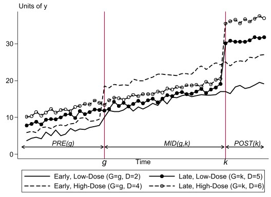</center>

---

count: false

# How should $\beta^{twfe}$ be interpreted?

We show in the paper that $\beta^{twfe}$ is a weighted average of the following terms:

$$\delta^{WITHIN}(g) = \frac{\textrm{cov}(\bar{Y}^{POST}(g) - \bar{Y}^{PRE(g)}(g), D | G=g)}{\textrm{var(D|G=g)}}$$

* Comes from <span class="alert">within-group variation in the amount of dose</span>

* This term is essentially the same as in the baseline case and corresponds to a <span class="alert">reasonable</span> treatment effect parameter under strong parallel trends

* Like baseline case, (after some manipulations) this term corresponds to a "derivative"/"ACR"

* Does not show up in the binary treatment case because there is no variation in amount of treatment

---

count: false

# How should $\beta^{twfe}$ be interpreted?

<center>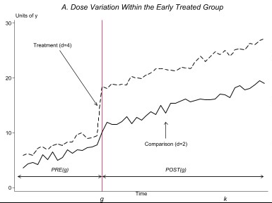</center>

---

count: false

# How should $\beta^{twfe}$ be interpreted?

<center>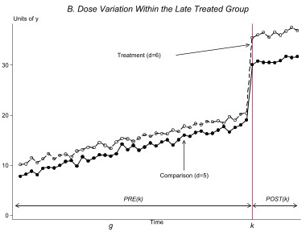</center>

---

count: false

# $\beta^{twfe}$ weighted average, term 2 of 4

For $k > g$ (i.e., group $k$ becomes treated after group $g$),

$$\delta^{MID,PRE}(g,k) =  \frac{\E\left[\big(\bar{Y}^{MID(g,k)} - \bar{Y}^{PRE(g)}\big) | G=g\right] - \E\left[\big(\bar{Y}^{MID(g,k)} - \bar{Y}^{PRE(g)}\big) | G=k \right]}{\E[D|G=g]}$$

* Comes from <span class="alert">comparing path of outcomes for a group that becomes treated (group $g$) relative to a not-yet-treated group (group $k$)</span>

* Corresponds to a <span class="alert">reasonable</span> treatment effect parameter under strong parallel trends

* Denominator (after some derivations) ends up giving this a "derivative"/"ACR" interpretation

* Similar terms show up in the case with a binary treatment

---

count: false

# $\beta^{twfe}$ weighted average, term 2 of 4

<center>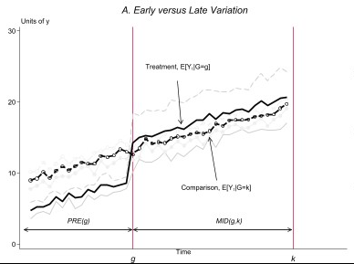</center>

---

count: false

# $\beta^{twfe}$ weighted average, term 3 of 4

For $k > g$ (i.e., group $k$ becomes treated after group $g$),

$$
\begin{aligned}
\delta^{POST,MID}(g,k) &=  \frac{\E\left[\big(\bar{Y}^{POST(k)} - \bar{Y}^{MID(g,k)}\big) | G=k\right] - \E\left[\big(\bar{Y}^{POST(k)} - \bar{Y}^{MID(g,k)}\big) | D=0 \right]}{\E[D|G=k]} \\
&- \left(\frac{\E\left[\big(\bar{Y}^{POST(k)} - \bar{Y}^{PRE(k)}\big) | G=g\right] - \E\left[\big(\bar{Y}^{POST(k)} - \bar{Y}^{PRE(g)}\big) | D=0 \right]}{\E[D|G=k]} \right.\\
& \hspace{25pt} - \left.\frac{\E\left[\big(\bar{Y}^{MID(g,k)} - \bar{Y}^{PRE(k)}\big) | G=g\right] - \E\left[\big(\bar{Y}^{MID(g,k)} - \bar{Y}^{PRE(g)}\big) | D=0 \right]}{\E[D|G=k]} \right)
\end{aligned}
$$
---

count: false

# $\beta^{twfe}$ weighted average, term 3 of 4

For $k > g$ (i.e., group $k$ becomes treated after group $g$),

$$
\begin{aligned}
\delta^{POST,MID}(g,k) &=  \frac{\E\left[\big(\bar{Y}^{POST(k)} - \bar{Y}^{MID(g,k)}\big) | G=k\right] - \E\left[\big(\bar{Y}^{POST(k)} - \bar{Y}^{MID(g,k)}\big) | D=0 \right]}{\E[D|G=k]} \\
&- \textrm{Treatment Effect Dynamics for Group g}
\end{aligned}
$$
* Comes from <span class="alert">comparing path of outcomes for a group that becomes treated (group $k$) to paths of outcomes of an already treated group (group $g$)</span>

* In the presence of treatment effect dynamics (these are not ruled out by any parallel trends assumption), this term is <span class="alert">problematic</span>

* This is similar-in-spirit to the problematic terms for TWFE with a binary treatment

---

count: false

# $\beta^{twfe}$ weighted average, term 3 of 4

<center>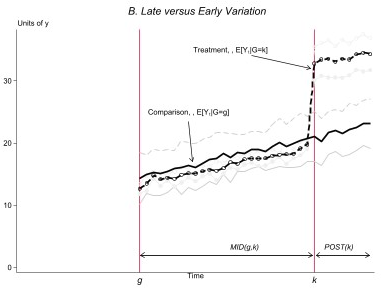</center>

---

count: false

# $\beta^{twfe}$ weighted average, term 4 of 4

For $k > g$ (i.e., group $k$ becomes treated after group $g$),

$$
\begin{aligned}
\delta^{POST,PRE}(g,k) =  \frac{\E\left[\big(\bar{Y}^{POST(k)} - \bar{Y}^{PRE(g)}\big) | G=g\right] - \E\left[\big(\bar{Y}^{POST(k)} - \bar{Y}^{PRE(g)}\big) | G=k \right]}{\E[D|G=g] - \E[D|G=k]}
\end{aligned}
$$
* Comes from <span class="alert">comparing path of outcomes for groups $g$ and $k$ in their common post-treatment periods relative to their common pre-treatment periods</span>

* In the presence of heterogeneous causal responses (causal response in same time period differs across groups), this term ends up being (partially) <span class="alert">problematic</span> too

* Only shows up when $\E[D|G=g] \neq \E[D|G=k]$

* No analogue in the binary treatment case

---

count: false

# $\beta^{twfe}$ weighted average, term 4 of 4

<center>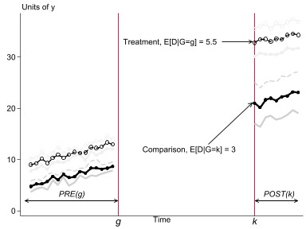</center>

---

count: false

# Summary of TWFE Issues

* Issue \#1: Selection bias terms that show up under standard parallel trends

  $\implies$ to interpret as a weighted average of any kind of causal responses, need to invoke (likely substantially) stronger assumptions
  
--
  
* Issue \#2: Weights

  * Negative weights possible due to (i) treatment effect dynamics or (ii) heterogeneous causal responses across groups
  
  * Are (undesirably) driven by estimation method

--
  
Weights issues can be solved by carefully making desirable comparisons and user-chosen appropriate weights

--

Selection bias terms are more fundamental challenge

